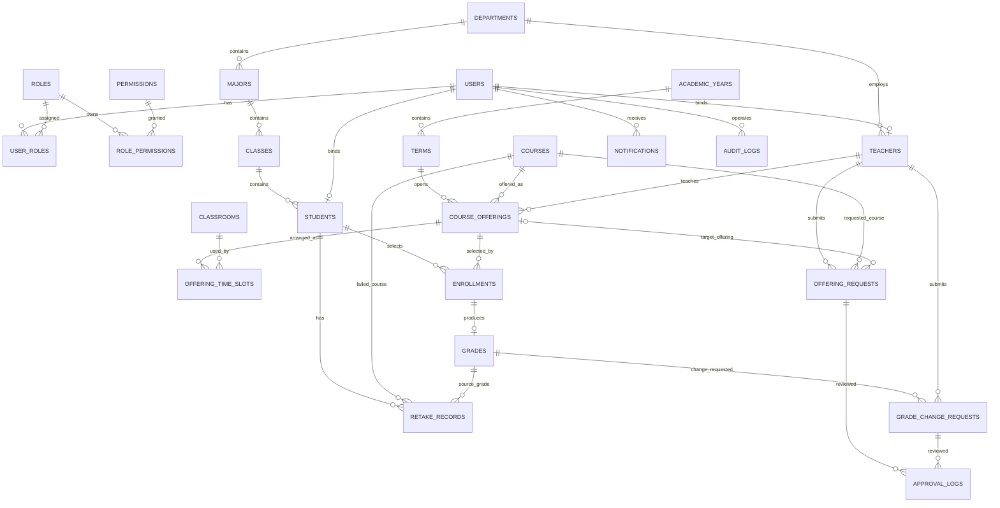

# 学分制教务选课管理系统数据库设计

## 一、系统总体定位

本系统是在 `School` 数据库基础上扩展的 B/S 结构学分制教务选课管理系统，主要服务于三类用户：学生、教师、系统管理员。

系统以“学年-学期”为基本单位管理教学活动。一个学年固定包含两个正式教学学期：

| 学期序号 | 含义 | 示例 |
| --- | --- | --- |
| 第一学期 | 一学年的上半学期 | 2025-2026 学年第一学期 |
| 第二学期 | 一学年的下半学期 | 2025-2026 学年第二学期 |

系统中必须区分“课程”和“开课班”：

| 概念 | 含义 | 示例 |
| --- | --- | --- |
| 课程 | 课程库中的抽象课程资源 | 数据库原理 |
| 开课班 | 某学期、某教师、某时间地点开设的具体教学班 | 2025-2026 第一学期，张老师，周一 1-2 节，数据库原理-01 班 |

学生选择的不是抽象的“数据库原理”这门课，而是某个学期、某位教师、某个时间地点的具体开课班。这一点是后续选课、退课、课表、成绩和重修设计的核心。

---

## 二、系统功能分析

### 2.1 功能模块总览

| 模块 | 功能说明 | 主要角色 |
| --- | --- | --- |
| 登录与权限管理 | 登录、注销、修改密码、角色识别、菜单权限控制 | 学生、教师、管理员 |
| 学年学期管理 | 创建学年、设置两个学期、设置当前学期和各类业务时间 | 管理员 |
| 课程库管理 | 维护课程本身的信息，如课程编号、名称、学分、类型、是否允许重修 | 管理员 |
| 教室资源管理 | 维护教室、容量、是否可用，用于排课和扩容判断 | 管理员 |
| 开课管理 | 将课程安排到具体学期，形成具体开课班 | 管理员、教师 |
| 选课管理 | 学生查看可选课程、在线选课、查看容量和选课状态 | 学生 |
| 退课管理 | 学生在规定时间内退课，系统释放容量并保留退课记录 | 学生、管理员 |
| 课表管理 | 输出学生课表和教师授课课表 | 学生、教师、管理员 |
| 成绩管理 | 教师录入和提交成绩，管理员发布成绩，学生查询成绩 | 教师、管理员、学生 |
| 挂科与重修管理 | 识别不及格课程、生成待重修记录、安排重修班、保留历史成绩 | 学生、教师、管理员 |
| 教师申请审批 | 教师提交开课、扩容、调课、停课、成绩修改申请，管理员审批 | 教师、管理员 |
| 通知与导出 | 发送选课、退课、审批、成绩发布、课程取消通知，导出课表和成绩单 | 学生、教师、管理员 |
| 统计分析 | 统计选课人数、课程容量、教师工作量、成绩分布、挂科率、重修情况 | 管理员、教师、学生 |

### 2.2 学生端功能

| 功能 | 说明 |
| --- | --- |
| 查看个人信息 | 查看学号、姓名、性别、专业、班级、年级、当前学年学期，可维护手机号、邮箱等非关键资料 |
| 查看当前学期可选课程 | 查看课程编号、课程名、学分、教师、时间、地点、容量、当前人数、课程类型、是否重修班 |
| 课程搜索与筛选 | 按课程名、教师、课程类型、上课时间、是否有余量、是否重修课筛选 |
| 查看课程详情 | 查看课程简介、教学目标、考核方式、学分、学时、适用专业和年级 |
| 查看课程容量 | 显示 `当前有效选课人数/最大容量`，如 `10/40`、`40/40` |
| 在线选课 | 在选课时间内选择具体开课班，系统自动判断容量、时间冲突、重复课程、重修资格等 |
| 在线退课 | 在退课截止时间前退掉当前学期已选课程，退课后释放容量 |
| 查看已选课程 | 查看当前学期已选课程、教师、学分、时间地点、是否重修、选课时间 |
| 输出个人课表 | 按星期和节次生成当前学期课表，支持导出或打印 |
| 查看成绩 | 查看各学期课程成绩、是否通过、是否重修、是否计入平均成绩 |
| 查看平均成绩 | 查看普通平均分、学分加权平均分、平均绩点 |
| 查看挂科与重修情况 | 查看待重修、重修中、重修通过、重修未通过等状态 |
| 查看通知 | 接收选课成功、退课成功、课程取消、成绩发布、重修提醒等消息 |
| 导出资料 | 导出个人课表、选课结果、成绩单 |

### 2.3 教师端功能

| 功能 | 说明 |
| --- | --- |
| 查看个人信息 | 查看工号、姓名、学院、职称、联系方式等 |
| 查看授课任务 | 查看本人本学期和历史学期承担的课程、教学班、时间地点、容量和状态 |
| 查看课程容量 | 查看课程班当前人数和容量，如 `35/40` |
| 查看选课学生名单 | 查看本人课程下的学生学号、姓名、专业、班级、是否重修、选课时间、成绩状态 |
| 提出开课申请 | 申请在某学年学期开设某门课程，填写建议时间、地点、容量、是否重修班、申请理由 |
| 提出扩容申请 | 当前容量不足时申请增加课程容量，管理员审批后生效 |
| 提出调课申请 | 申请调整上课时间或地点，审批前需要检测教师、教室、学生课表冲突 |
| 提出停课或取消开课申请 | 因人数过少或其他原因申请取消课程班，审批通过后通知已选学生 |
| 录入成绩 | 为本人课程下的已选学生录入平时成绩、实验成绩、期末成绩、总评成绩和备注 |
| 提交成绩 | 成绩录入完成后提交，提交后不能随意修改 |
| 成绩修改申请 | 成绩提交或发布后发现错误，需要向管理员申请修改 |
| 查看成绩统计 | 查看选课人数、参考人数、及格人数、不及格人数、平均分、最高分、最低分、挂科率、重修人数 |
| 查看审批进度 | 查看本人提交申请的审批状态和管理员意见 |

### 2.4 管理员端功能

| 功能 | 说明 |
| --- | --- |
| 用户管理 | 管理学生和教师账号，支持新增、修改、禁用、重置密码、查询 |
| 角色权限管理 | 为学生、教师、管理员分配不同权限和菜单 |
| 学年学期管理 | 新建学年，创建第一学期和第二学期，设置当前学期 |
| 业务时间管理 | 设置选课开始/结束时间、退课截止时间、成绩录入时间、成绩公布时间 |
| 课程库管理 | 维护课程编号、名称、学分、学时、课程类型、适用专业年级、是否允许重修 |
| 教室资源管理 | 维护教室编号、教学楼、教室容量、是否可用 |
| 开课安排管理 | 管理员直接安排课程开设，指定教师、学期、时间、地点、容量、是否重修班 |
| 审批教师申请 | 审批开课、扩容、调课、停课、成绩修改申请 |
| 选课过程管理 | 查看所有课程选课人数、满员课程、选课不足课程，开放或关闭某课程选课 |
| 特殊选课处理 | 对特殊学生进行补选、退课、调整，但需要记录原因并尽量遵守冲突和容量规则 |
| 成绩管理 | 查看成绩、审核成绩提交、发布成绩、退回成绩修改、导出成绩表 |
| 挂科与重修管理 | 查看挂科名单、待重修学生、安排重修班、统计重修通过情况 |
| 课程取消处理 | 对低于最低开课人数的课程进行取消，并通知学生重新选课 |
| 统计与导出 | 导出学生名单、课程表、成绩表、重修名单、教师授课表和各类统计报表 |
| 日志审计 | 查看关键操作记录，如管理员强制选课、成绩修改、课程取消、审批操作 |

### 2.5 建议补充功能

| 补充功能 | 设计意义 |
| --- | --- |
| 课程状态提示 | 在学生选课页显示可选、已选、已满、时间冲突、已通过不可选、待重修可选等原因 |
| 最低开课人数 | 选修课低于最低人数时，管理员可取消开课并通知学生重选 |
| 教师和教室冲突检测 | 管理员排课和审批调课时，检测同一教师或同一教室同一时间不能安排两门课 |
| 专业年级必修课冲突提示 | 同一专业同一年级的必修课尽量不安排在同一时间 |
| 成绩可见性控制 | 成绩未发布前学生不能查看，避免教师草稿成绩被提前看到 |
| 管理员强制处理审计 | 管理员特殊补选、退课、改成绩必须记录原因和操作人 |
| 通知消息 | 课程取消、审批结果、成绩发布、重修提醒都应通知相关用户 |

---

## 三、概念设计

### 3.1 核心业务概念

| 概念 | 说明 |
| --- | --- |
| 学年 | 教学年度单位，如 2025-2026 学年 |
| 学期 | 学年下的第一学期或第二学期 |
| 课程 | 课程库中的课程本身，如数据库原理 |
| 开课班 | 课程在某学期由某教师以某时间地点开设形成的具体教学班 |
| 有效选课 | 状态为已选或已完成的选课记录，用于统计当前人数 |
| 退课记录 | 学生退课后不物理删除，而是保留状态和退课时间 |
| 成绩记录 | 每次修读课程都会形成独立成绩记录，重修成绩不能覆盖原成绩 |
| 重修资格 | 学生有已发布的不及格成绩后，才能在后续学期选择该课程重修 |
| 教师申请 | 教师对开课、扩容、调课、停课、成绩修改提出的申请 |
| 审批记录 | 管理员对教师申请或特殊业务处理形成的审批痕迹 |

### 3.2 核心实体

| 实体 | 主要属性 | 说明 |
| --- | --- | --- |
| 用户 | 用户编号、用户名、密码、真实姓名、联系方式、账号状态 | 登录主体 |
| 角色 | 角色编号、角色编码、角色名称 | 学生、教师、管理员等 |
| 权限 | 权限编号、权限编码、权限名称 | 控制菜单和操作 |
| 学院 | 学院编号、学院名称、联系电话 | 组织结构 |
| 专业 | 专业编号、专业名称、所属学院 | 学生和课程适用范围 |
| 班级 | 班级编号、班级名称、专业、年级 | 学生行政班 |
| 学生 | 学生编号、学号、用户、班级、学籍状态 | 选课主体 |
| 教师 | 教师编号、工号、用户、学院、职称 | 授课和成绩录入主体 |
| 学年 | 学年编号、学年名称、开始年份、结束年份 | 一个学年对应两个学期 |
| 学期 | 学期编号、学年、学期序号、开始日期、结束日期、当前标识 | 教学活动时间范围 |
| 课程 | 课程编号、课程代码、名称、学分、学时、类型、是否允许重修、是否启用 | 课程库 |
| 教室 | 教室编号、教学楼、教室名称、容量、可用状态 | 排课资源 |
| 开课班 | 开课编号、课程、学期、教师、教学班名称、容量、最低人数、是否重修班、状态 | 学生实际选择对象 |
| 开课时间段 | 开课班、星期、开始节次、结束节次、周次、教室 | 用于课表和冲突判断 |
| 选课记录 | 学生、开课班、选课时间、退课时间、状态、是否重修、修读次数 | 保存选课和退课历史 |
| 成绩 | 选课记录、平时成绩、实验成绩、期末成绩、总评成绩、是否通过、状态 | 保存每次修读结果 |
| 重修记录 | 学生、课程、原成绩、当前状态、关联重修选课 | 管理待重修、重修中、重修通过等状态 |
| 教师申请 | 教师、申请类型、课程、开课班、申请内容、申请状态 | 开课、扩容、调课、停课申请 |
| 成绩修改申请 | 教师、成绩记录、原成绩、新成绩、原因、状态 | 成绩发布后修改需要审批 |
| 审批记录 | 审批对象、审批人、审批结果、审批意见、审批时间 | 保存管理员处理过程 |
| 通知 | 接收用户、标题、内容、阅读状态、发送时间 | 系统消息 |
| 操作日志 | 操作人、操作类型、对象、原因、时间 | 审计关键操作 |

### 3.3 实体联系说明

| 联系 | 类型 | 说明 |
| --- | --- | --- |
| 用户-角色 | 多对多 | 一个用户可拥有多个角色 |
| 角色-权限 | 多对多 | 一个角色可拥有多个权限 |
| 学院-专业 | 一对多 | 一个学院下有多个专业 |
| 专业-班级 | 一对多 | 一个专业下有多个班级 |
| 班级-学生 | 一对多 | 一个班级下有多个学生 |
| 学院-教师 | 一对多 | 一个学院下有多个教师 |
| 用户-学生 | 一对一 | 一个学生绑定一个登录账号 |
| 用户-教师 | 一对一 | 一个教师绑定一个登录账号 |
| 学年-学期 | 一对多 | 一个学年包含第一学期和第二学期 |
| 课程-开课班 | 一对多 | 一门课程可在不同学期形成多个开课班 |
| 学期-开课班 | 一对多 | 一个学期有多个开课班 |
| 教师-开课班 | 一对多 | 一个教师可承担多个开课班 |
| 教室-开课时间段 | 一对多 | 一个教室可被多个不冲突的时间段使用 |
| 开课班-开课时间段 | 一对多 | 一个开课班可有多个上课时间段 |
| 学生-开课班 | 多对多 | 通过选课记录实现 |
| 选课记录-成绩 | 一对一 | 一条选课记录最多对应一条成绩记录 |
| 学生-课程-重修记录 | 多对多扩展 | 学生某课程不及格后生成待重修记录 |
| 教师-教师申请 | 一对多 | 教师可提交多种申请 |
| 申请-审批记录 | 一对多 | 一条申请可以形成审批处理记录 |
| 用户-通知 | 一对多 | 用户接收系统通知 |

### 3.4 ER 图

---

## 四、逻辑设计

### 4.1 数据表分组

| 模块 | 数据表 |
| --- | --- |
| 用户权限模块 | `Users`、`Roles`、`Permissions`、`UserRoles`、`RolePermissions` |
| 组织人员模块 | `Departments`、`Majors`、`Classes`、`Students`、`Teachers` |
| 学年学期模块 | `AcademicYears`、`Terms`、`BusinessTimeWindows` |
| 课程资源模块 | `Courses`、`CourseApplicableMajors`、`CoursePrerequisites`、`Classrooms` |
| 开课排课模块 | `CourseOfferings`、`OfferingTimeSlots` |
| 选课退课模块 | `SelectionBatches`、`SelectionRules`、`Enrollments` |
| 成绩重修模块 | `Grades`、`RetakeRecords`、`GradeChangeRequests` |
| 申请审批模块 | `OfferingRequests`、`ApprovalLogs` |
| 通知审计模块 | `Notifications`、`AuditLogs`、`DataDictionaries` |

### 4.2 用户权限模块

| 表名 | 主键 | 关键字段 | 说明 |
| --- | --- | --- | --- |
| `Users` | `user_id` | `username`、`password_hash`、`real_name`、`phone`、`email`、`status` | 登录账号 |
| `Roles` | `role_id` | `role_code`、`role_name` | 学生、教师、管理员 |
| `Permissions` | `permission_id` | `permission_code`、`permission_name`、`module_name` | 权限点 |
| `UserRoles` | `user_id + role_id` | `user_id`、`role_id` | 用户和角色多对多 |
| `RolePermissions` | `role_id + permission_id` | `role_id`、`permission_id` | 角色和权限多对多 |

### 4.3 组织人员模块

| 表名 | 主键 | 关键字段 | 说明 |
| --- | --- | --- | --- |
| `Departments` | `department_id` | `department_name`、`office_phone` | 学院 |
| `Majors` | `major_id` | `department_id`、`major_name` | 专业 |
| `Classes` | `class_id` | `major_id`、`class_name`、`grade_year` | 行政班 |
| `Students` | `student_id` | `user_id`、`student_no`、`class_id`、`gender`、`enroll_year`、`student_status` | 学生 |
| `Teachers` | `teacher_id` | `user_id`、`teacher_no`、`department_id`、`title` | 教师 |

### 4.4 学年学期模块

| 表名 | 主键 | 关键字段 | 说明 |
| --- | --- | --- | --- |
| `AcademicYears` | `academic_year_id` | `academic_year_name`、`start_year`、`end_year` | 学年，如 2025-2026 学年 |
| `Terms` | `term_id` | `academic_year_id`、`term_no`、`term_name`、`start_date`、`end_date`、`is_current` | 学期，`term_no` 为 1 或 2 |
| `BusinessTimeWindows` | `window_id` | `term_id`、`window_type`、`start_time`、`end_time`、`status` | 选课、退课、成绩录入、成绩公布等业务时间 |

`BusinessTimeWindows.window_type` 可包括：`select`、`drop`、`grade_entry`、`grade_publish`、`appeal`。

### 4.5 课程资源模块

| 表名 | 主键 | 关键字段 | 说明 |
| --- | --- | --- | --- |
| `Courses` | `course_id` | `course_code`、`course_name`、`credits`、`hours`、`course_type`、`assessment_type`、`allow_retake`、`is_enabled`、`description` | 课程库 |
| `CourseApplicableMajors` | `course_id + major_id + grade_year` | `course_id`、`major_id`、`grade_year`、`is_required` | 课程适用专业和年级 |
| `CoursePrerequisites` | `course_id + prerequisite_course_id` | `course_id`、`prerequisite_course_id` | 先修课程 |
| `Classrooms` | `classroom_id` | `building`、`room_no`、`capacity`、`status` | 教室资源 |

课程类型建议包括：必修课、选修课、通识课、实践课、重修课。重修课也可以不作为课程库中的单独课程类型，而是在具体开课班中用 `is_retake_class` 标记。

### 4.6 开课排课模块

| 表名 | 主键 | 关键字段 | 说明 |
| --- | --- | --- | --- |
| `CourseOfferings` | `offering_id` | `term_id`、`course_id`、`teacher_id`、`teaching_class_name`、`capacity`、`min_enrollment`、`selected_count_cached`、`is_retake_class`、`status`、`source_request_id` | 具体开课班 |
| `OfferingTimeSlots` | `time_slot_id` | `offering_id`、`weekday`、`start_section`、`end_section`、`week_start`、`week_end`、`classroom_id` | 结构化上课时间 |

`selected_count_cached` 可以作为缓存字段，用于快速显示 `10/40`。但系统判断容量时应以有效选课记录统计为准，避免缓存人数和真实选课记录不一致。

`CourseOfferings.status` 建议包括：待审批、已通过、开放选课、关闭选课、已取消、已结课。

### 4.7 选课退课模块

| 表名 | 主键 | 关键字段 | 说明 |
| --- | --- | --- | --- |
| `SelectionBatches` | `batch_id` | `term_id`、`batch_name`、`select_start_time`、`select_end_time`、`drop_deadline`、`status` | 选课批次 |
| `SelectionRules` | `rule_id` | `batch_id`、`max_credits`、`min_credits`、`allow_cross_major`、`allow_retake`、`check_time_conflict`、`check_prerequisite` | 选课规则 |
| `Enrollments` | `enrollment_id` | `student_id`、`offering_id`、`enroll_time`、`drop_time`、`status`、`is_retake`、`attempt_no`、`operator_user_id`、`remark` | 选课和退课记录 |

`Enrollments.status` 建议包括：已选、已退、已完成、因课程取消失效。

### 4.8 成绩重修模块

| 表名 | 主键 | 关键字段 | 说明 |
| --- | --- | --- | --- |
| `Grades` | `grade_id` | `enrollment_id`、`usual_score`、`experiment_score`、`final_score`、`total_score`、`grade_point`、`is_passed`、`is_retake`、`included_in_average`、`score_status`、`submitted_by`、`published_at` | 成绩记录 |
| `RetakeRecords` | `retake_id` | `student_id`、`course_id`、`source_grade_id`、`status`、`created_term_id`、`current_enrollment_id`、`resolved_term_id` | 重修状态 |
| `GradeChangeRequests` | `request_id` | `teacher_id`、`grade_id`、`old_total_score`、`new_total_score`、`reason`、`status`、`created_at` | 成绩修改申请 |

`Grades.score_status` 建议包括：未录入、草稿、已录入、已提交、已发布、已冻结。

重修成绩必须新增成绩记录，不能覆盖原始不及格成绩。

### 4.9 申请审批模块

| 表名 | 主键 | 关键字段 | 说明 |
| --- | --- | --- | --- |
| `OfferingRequests` | `request_id` | `teacher_id`、`request_type`、`course_id`、`offering_id`、`term_id`、`requested_capacity`、`requested_time`、`requested_classroom_id`、`is_retake_class`、`reason`、`conflict_check_result`、`status` | 教师开课、扩容、调课、停课申请 |
| `ApprovalLogs` | `approval_id` | `target_type`、`target_id`、`approver_user_id`、`approval_result`、`approval_comment`、`approved_at` | 通用审批记录 |

`OfferingRequests.request_type` 建议包括：开课申请、扩容申请、调课申请、停课申请。

`ApprovalLogs.target_type` 可指向开课申请、成绩修改申请、特殊选课处理等不同审批对象。

### 4.10 通知审计模块

| 表名 | 主键 | 关键字段 | 说明 |
| --- | --- | --- | --- |
| `Notifications` | `notification_id` | `receiver_user_id`、`title`、`content`、`notification_type`、`is_read`、`created_at` | 消息通知 |
| `AuditLogs` | `log_id` | `operator_user_id`、`operation_type`、`target_type`、`target_id`、`reason`、`created_at` | 操作审计 |
| `DataDictionaries` | `dict_id` | `dict_type`、`dict_code`、`dict_name`、`sort_no`、`is_enabled` | 状态和类别字典 |

---

## 五、关键业务规则设计

### 5.1 选课规则

| 规则 | 说明 |
| --- | --- |
| 选课时间限制 | 只有当前时间处于选课时间窗口内，学生才能选课 |
| 课程容量限制 | 有效选课人数必须小于课程容量才允许选课 |
| 同一开课班不能重复选 | 同一学生不能重复选择同一个开课班 |
| 同学期同课程只能选一个教学班 | 同一学生在同一学期只能选择同一课程的一个开课班，不能同时选择不同教师的同一门课 |
| 当前修读中不能重复选 | 学生当前学期已有该课程有效选课记录时，不能再次选择该课程 |
| 已通过课程不能再选 | 学生历史成绩中该课程已有通过记录时，正常情况下不能再选 |
| 挂科后才能重修 | 只有已发布的不及格成绩才能生成重修资格 |
| 重修必须在后续学期 | 同一学期内不能因为预期挂科而立即重修，必须等成绩发布后在后续学期开课时选择 |
| 上课时间不能冲突 | 新课程时间与已选课程时间在星期、周次、节次上有重叠时禁止选课 |
| 专业年级限制 | 非适用专业或年级的课程，根据规则决定是否允许跨专业选课 |
| 先修课程限制 | 有先修要求的课程，必须先通过先修课程 |

### 5.2 退课规则

| 规则 | 说明 |
| --- | --- |
| 只能退当前学期课程 | 历史学期课程不能退 |
| 必须在退课截止时间前 | 超过退课截止时间不能普通退课 |
| 已录入或已发布成绩不能退 | 课程已有成绩记录后不能普通退课 |
| 管理员锁定课程不能退 | 管理员可因特殊原因锁定课程 |
| 退课保留记录 | 退课不物理删除，状态改为已退并记录退课时间 |
| 退课释放容量 | 已退记录不再计入有效选课人数 |

### 5.3 课表冲突规则

判断时间冲突时，需要比较以下字段：

| 字段 | 判断方式 |
| --- | --- |
| 星期 | 相同星期才可能冲突 |
| 周次范围 | 周次范围有交集才可能冲突 |
| 节次范围 | 节次范围有交集才可能冲突 |
| 学期 | 只有同一学期内才判断课表冲突 |

如果星期相同、周次有交集、节次有交集，则认为冲突。

该规则不仅用于学生选课，也用于管理员排课、教师调课审批、教室占用判断。

### 5.4 开课与排课规则

| 规则 | 说明 |
| --- | --- |
| 教师同一时间不能上两门课 | 管理员排课或审批调课时必须检测教师冲突 |
| 教室同一时间不能安排两门课 | 同一教室同一时间只能被一个开课班占用 |
| 课程容量不能超过教室容量 | 开课容量和扩容后容量不能大于教室容量 |
| 低于最低开课人数可取消 | 选课结束后低于最低人数的课程可由管理员取消 |
| 取消课程需通知学生 | 已选学生需要重新选课 |
| 重修班需有重修需求 | 开设重修班时应参考待重修人数 |

### 5.5 成绩规则

| 规则 | 说明 |
| --- | --- |
| 教师只能录入本人课程成绩 | 教师不能录入非本人课程班的学生成绩 |
| 成绩未发布前学生不可见 | 学生只能查看已发布成绩 |
| 总评成绩可自动计算 | 可按平时成绩、实验成绩、期末成绩设置比例计算 |
| 60 分及以上通过 | 总评成绩大于等于 60 视为通过 |
| 低于 60 分挂科 | 自动生成或更新待重修状态 |
| 提交后不能随意修改 | 教师提交成绩后，如需修改必须申请 |
| 重修成绩不能覆盖原成绩 | 每次修读都保留独立成绩记录 |
| 重修仍不通过继续待重修 | 重修未通过时继续保留待重修状态 |

### 5.6 管理员特殊处理规则

管理员可以处理特殊选课、退课、成绩修改等情况，但必须满足以下要求：

| 要求 | 说明 |
| --- | --- |
| 记录操作原因 | 每次特殊处理必须填写原因 |
| 记录操作人 | 保存管理员用户编号 |
| 尽量遵守普通规则 | 补选仍应检查容量、重复课程、时间冲突 |
| 强制处理需审计 | 如果强制绕过规则，需要在日志中明确标记 |
| 关联通知 | 对学生和教师产生影响的操作应发送通知 |

---

## 六、常用视图与查询设计

| 视图/查询 | 用途 | 主要字段 |
| --- | --- | --- |
| `V_StudentAvailableCourses` | 学生查看可选课程 | 学期、课程、教师、学分、时间、教室、容量显示、选课状态提示 |
| `V_StudentSelectedCourses` | 学生查看已选课程 | 学生、课程、教师、学分、时间、地点、是否重修、选课时间 |
| `V_StudentTimetable` | 学生输出课表 | 星期、节次、周次、课程、教师、教室 |
| `V_StudentTranscript` | 学生查看成绩单 | 学年、学期、课程、学分、教师、成绩、是否通过、是否重修 |
| `V_StudentAverageScore` | 学生平均成绩 | 普通平均分、学分加权平均分、平均绩点 |
| `V_StudentRetakeStatus` | 学生查看挂科重修 | 课程、原成绩、挂科学期、当前状态 |
| `V_TeacherTeachingTasks` | 教师查看授课任务 | 学期、课程、教学班、时间、地点、容量、状态 |
| `V_TeacherRoster` | 教师查看选课名单 | 学号、姓名、专业、班级、是否重修、成绩状态 |
| `V_TeacherGradeStatistics` | 教师查看成绩统计 | 选课人数、及格人数、不及格人数、平均分、最高分、最低分、挂科率 |
| `V_AdminPendingApprovals` | 管理员查看待审批 | 申请人、申请类型、课程、学期、申请内容、冲突检测结果 |
| `V_CourseCapacityStatistics` | 课程容量统计 | 课程、教师、容量、当前人数、剩余名额、满员率 |
| `V_RetakeStatistics` | 重修统计 | 课程、挂科人数、待重修人数、重修通过人数 |

---

## 七、触发器与存储过程设计说明

题目要求数据库中至少包含一个触发器和一个存储过程。本阶段只进行设计说明，不写具体 SQL 编码。

### 7.1 触发器设计

| 项目 | 内容 |
| --- | --- |
| 触发器名称 | `trg_UpdateOfferingSelectedCount` |
| 触发表 | `Enrollments` |
| 触发时机 | 选课、退课、课程取消、选课状态变更后 |
| 作用 | 根据有效选课记录重新计算开课班当前人数 |
| 有效记录口径 | 状态为已选或已完成的选课记录 |
| 业务价值 | 保证 `10/40` 这类容量显示与真实选课记录一致 |

### 7.2 存储过程设计

| 项目 | 内容 |
| --- | --- |
| 存储过程名称 | `sp_StudentSelectCourse` |
| 调用场景 | 学生点击“选课”时由系统调用 |
| 输入 | 学生编号、开课班编号 |
| 核心检查 | 选课时间、学籍状态、课程状态、容量、同学期同课程、历史通过记录、重修资格、时间冲突、专业年级、先修课程 |
| 成功结果 | 新增一条有效选课记录 |
| 失败结果 | 返回明确原因，如已满、时间冲突、已通过、未到重修条件等 |

### 7.3 可选存储过程

| 名称 | 用途 |
| --- | --- |
| `sp_StudentDropCourse` | 学生退课并释放容量 |
| `sp_TeacherSubmitGrade` | 教师提交成绩并自动判断是否通过 |
| `sp_AdminPublishGrades` | 管理员发布成绩 |
| `sp_CreateRetakeRecords` | 根据不及格成绩生成待重修记录 |
| `sp_AdminApproveRequest` | 管理员审批教师申请 |
| `sp_CheckScheduleConflict` | 检测学生、教师、教室时间冲突 |

---

## 八、角色权限设计

### 8.1 角色权限分配

| 角色 | 主要权限 |
| --- | --- |
| 学生 | 查看可选课程、搜索课程、查看容量、选课、退课、查看已选课程、输出课表、查看成绩、查看平均成绩、查看重修状态 |
| 教师 | 查看授课任务、查看选课名单、提交开课/扩容/调课/停课申请、录入成绩、提交成绩、申请成绩修改、查看成绩统计 |
| 管理员 | 管理用户、角色权限、学年学期、课程库、教室、开课计划、审批申请、管理选课过程、发布成绩、管理重修、统计导出 |

### 8.2 关键权限点

| 权限编码 | 权限名称 | 建议角色 |
| --- | --- | --- |
| `COURSE_SELECT` | 在线选课 | 学生 |
| `COURSE_DROP` | 在线退课 | 学生 |
| `TIMETABLE_VIEW_EXPORT` | 查看和导出课表 | 学生、教师 |
| `GRADE_VIEW_SELF` | 查看本人已发布成绩 | 学生 |
| `OFFERING_REQUEST_SUBMIT` | 提交开课相关申请 | 教师 |
| `ROSTER_VIEW` | 查看本人课程学生名单 | 教师 |
| `GRADE_INPUT` | 成绩录入 | 教师 |
| `GRADE_SUBMIT` | 成绩提交 | 教师 |
| `GRADE_CHANGE_REQUEST` | 成绩修改申请 | 教师 |
| `REQUEST_APPROVE` | 审批教师申请 | 管理员 |
| `OFFERING_MANAGE` | 开课安排管理 | 管理员 |
| `GRADE_PUBLISH` | 成绩发布 | 管理员 |
| `RETAKE_MANAGE` | 挂科重修管理 | 管理员 |
| `SPECIAL_ENROLLMENT_HANDLE` | 特殊选课退课处理 | 管理员 |
| `STATISTICS_EXPORT` | 统计与导出 | 管理员 |

---

## 九、核心业务流程

### 9.1 正常选课流程

1. 管理员创建学年和两个学期。
2. 管理员发布当前学期开课班。
3. 学生在选课时间内查看可选课程。
4. 学生选择具体开课班。
5. 系统检查容量、时间冲突、同课程重复、已通过记录、重修资格、专业年级、先修课程。
6. 检查通过后生成选课记录。
7. 系统更新课程容量显示。
8. 学生查看已选课程和课表。

### 9.2 退课流程

1. 学生查看当前学期已选课程。
2. 学生在退课截止时间前申请退课。
3. 系统检查是否当前学期、是否已录入成绩、是否被管理员锁定。
4. 检查通过后将选课状态改为已退。
5. 系统重新统计课程人数，例如 `10/40` 变为 `9/40`。

### 9.3 教师开课申请流程

1. 教师提交开课申请，填写课程、学年学期、建议时间地点、容量、是否重修班和理由。
2. 系统检测教师时间、教室时间、教室容量和课程适用范围。
3. 管理员查看申请和检测结果。
4. 审批通过后生成开课班。
5. 学生可在选课时间内选择该开课班。

### 9.4 扩容申请流程

1. 课程接近或达到满员。
2. 教师提交扩容申请。
3. 系统检查教室容量是否支持扩容。
4. 管理员审批通过后修改课程容量。
5. 学生可继续选课。

### 9.5 调课申请流程

1. 教师提交调课申请，填写原时间地点、新时间地点和原因。
2. 系统检测教师、新教室、已选学生课表是否冲突。
3. 管理员查看冲突检测结果。
4. 无冲突或处理完冲突后审批通过。
5. 系统更新开课时间段并通知学生。

### 9.6 成绩录入与发布流程

1. 课程结束后，教师录入成绩。
2. 系统计算总评成绩和是否通过。
3. 教师提交成绩。
4. 管理员审核并发布成绩。
5. 学生查看已发布成绩。
6. 系统根据成绩生成挂科和重修状态。

### 9.7 挂科重修流程

1. 学生成绩低于 60 分。
2. 系统保留原成绩记录，并生成待重修记录。
3. 后续学期该课程重新开设，学生可选择重修班或允许重修的普通开课班。
4. 重修产生新的选课记录和新的成绩记录。
5. 重修通过后，重修记录状态改为重修通过。
6. 重修仍不通过，则继续保留待重修状态。

---

## 十、设计对实验要求的满足情况

| 实验要求 | 设计体现 |
| --- | --- |
| B/S 结构实现 | 数据库作为 Web 系统后端统一数据层 |
| 基于 School 数据库修改 | 保留并扩展学生、教师、课程、选课、成绩核心结构 |
| 不同角色不同权限 | 使用用户、角色、权限和中间表控制 |
| 管理员教务管理功能 | 支持学年学期、课程库、开课、选课、成绩、重修、审批、统计 |
| 学生自主选课和查询 | 支持选课、退课、容量查看、课表、成绩、平均分、重修状态 |
| 教师成绩登录和教学管理 | 支持授课任务、学生名单、成绩录入、成绩统计和申请流程 |
| 不同角色统计分析 | 学生学分成绩统计、教师课程成绩统计、管理员全局统计 |
| 至少一个触发器和存储过程 | 设计了容量维护触发器和学生选课存储过程 |
| 支持 SQL Server/MySQL/Oracle/Gauss | 逻辑模型为通用关系模型，后续可落地到 SQL Server |
| 其他辅助功能 | 通知、导出、教室管理、最低开课人数、冲突检测、审计日志 |

---

## 十一、最需要注意的逻辑漏洞

| 漏洞 | 正确设计 |
| --- | --- |
| 学生同时选择同课程不同教师 | 同一学期同一课程只能有一条有效选课记录 |
| 学生已通过课程后再次选择 | 查询历史通过成绩，存在则禁止再次选课 |
| 当前学期正在修读又重复选 | 当前学期存在有效选课记录则禁止重复选择 |
| 上学期挂科后立即在同学期重选 | 必须等成绩发布并进入后续学期后才能重修 |
| 时间冲突仍允许选课 | 用结构化时间段检测星期、周次、节次交集 |
| 课程人数只靠手动字段 | 人数应由有效选课记录统计，缓存人数只用于展示 |
| 退课后未释放容量 | 已退记录不计入有效选课人数 |
| 重修成绩覆盖原成绩 | 每次修读都新增成绩记录，保留历史 |
| 成绩未发布学生可见 | 学生只能查看已发布成绩 |
| 教师提交成绩后随意修改 | 提交或发布后修改必须走成绩修改申请 |
| 调课只看教师是否空闲 | 还要检测教室和已选学生课表冲突 |
| 教师私自扩容或停课 | 教师只能提交申请，管理员审批后生效 |
| 课程取消未通知学生 | 课程取消后通知已选学生重新选课 |
| 管理员特殊处理无痕迹 | 特殊补选、退课、改成绩必须写入操作日志 |

